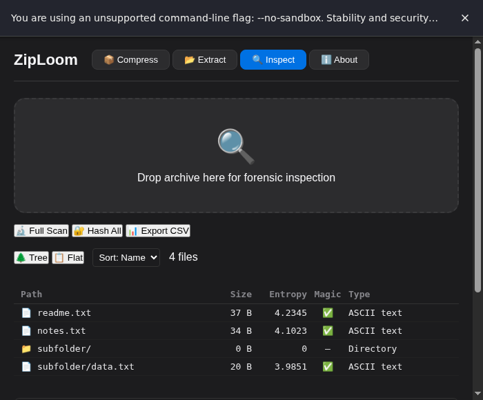
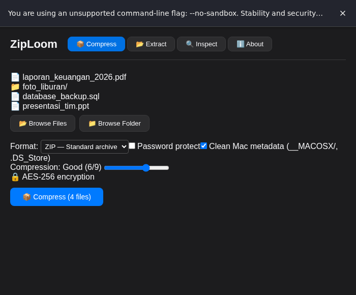
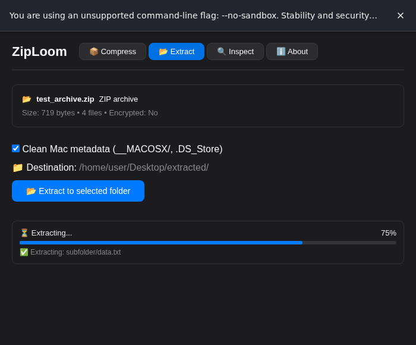
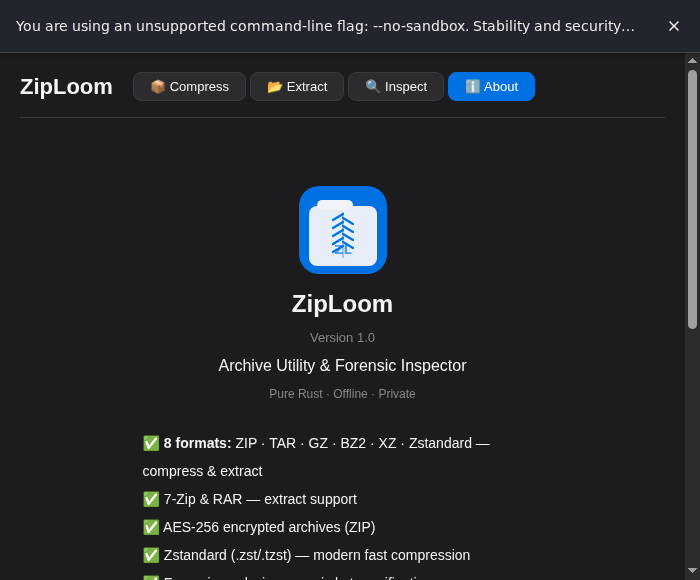

# ZipLoom — Archive Utility with Built-in Threat Detection

> **Inspect every file inside an archive before extracting.**  
> 100% offline · Pure Rust · No telemetry · No cloud

[](LICENSE)


---

Every archive you download could hide an `.exe`, a macro-laden `.docm`, or a ransomware note waiting to be executed.

**ZipLoom lets you open an archive and inspect every file inside — before extracting a single byte.**

---

## 🛡️ Threat Inspection

Before you extract, ZipLoom scans every entry with its pure Rust heuristic engine:

| What It Detects | How | Severity |
|----------------|-----|----------|
| **Windows PE (.exe/.dll)** | MZ header, section flags, import table — flags `VirtualAllocEx`, `WriteProcessMemory`, `CreateRemoteThread` | 🔴 Critical |
| **Process injection** | `NtUnmapViewOfSection`, `SetThreadContext` — process hollowing indicators | 🔴 Critical |
| **Writable + Executable section** | W^X violation in PE headers — classic shellcode injection | 🔴 Critical |
| **Packed executables** | Section names like `.upx`, `.vmp`, `.themida`, `.mpress` | 🟠 High |
| **Office macros (VBA)** | `AutoOpen`, `Document_Open` + `Shell`, `CreateObject`, `PowerShell` | 🔴 Critical |
| **Ransomware notes** | "your files have been encrypted", "bitcoin", "tor", "decryption key" | 🟠 High |
| **Encoded PowerShell** | `-EncodedCommand` + Base64 payloads | 🔴 Critical |
| **Obfuscated scripts** | `eval(`, `fromcharcode(`, `unescape(` — JS/HTML exploit patterns | 🟠 High |
| **Double extension** | `invoice.pdf.exe`, `document.doc.js` | 🟠 High |
| **Hidden files** | `.malware` — files concealed in archives | 🟢 Low |
| **Anti-debugging** | `IsDebuggerPresent`, `CheckRemoteDebuggerPresent` | 🟠 High |

**Risk score:** Each file is scored. The whole archive gets a label — `Clean`, `Low Risk`, `Suspicious`, `Highly Suspicious`, or `Malicious`.

> ⚡ **Zero internet, zero database, zero updates.**  
> All detection is structural — based on file format parsing and pattern matching. No signatures to download, no cloud API to call, no telemetry.

---

## 🔍 Forensic Inspector

For IT professionals who need to know exactly what's in an archive:

- **Magic byte verification** — detects format mismatch / tampering (a `.pdf` that's really an `.exe`)
- **Entropy analysis** — flags encrypted or compressed payloads hiding inside archives
- **Batch hashing** — MD5, SHA-1, SHA-256 per file for integrity verification
- **Anomaly detection** — high-entropy files, extension mismatch, suspicious structures
- **File tree view** — sortable columns with all metadata at a glance
- **CSV export** — full evidence trail for reporting

---

## 📦 Archive Operations

Full-featured archive utility — compress, extract, encrypt:

| Feature | Supported |
|---------|-----------|
| **Compress** | ZIP, TAR, TAR.GZ, TAR.BZ2, TAR.XZ, TAR.ZST |
| **Extract** | ZIP, TAR, TAR.GZ, TAR.BZ2, TAR.XZ, TAR.ZST, **7z, RAR** |
| **AES-256 encrypted ZIP** | ✅ Password-protected archives |
| **Split volumes** | ✅ Compress & split into chunks |
| **Compression levels** | 0–9 configurable |
| **Clean macOS junk** | Auto-strips `.DS_Store`, `__MACOSX`, `._` files |
| **Drag & drop** | ✅ Full drag-and-drop support |

---

## 🔒 Privacy

| | ZipLoom | 7-Zip | WinRAR | PeaZip |
|---|---|---|---|---|
| **Open source** | ✅ MIT | ✅ LGPL | ❌ | ✅ LGPL |
| **100% offline** | ✅ No network at all | ✅ (mostly) | ❌ (trial nag) | ✅ (mostly) |
| **No telemetry** | ✅ Zero ping home | ✅ | ❌ | ✅ |
| **Memory-safe lang** | ✅ Rust | ❌ C/C++ | ❌ C/C++ | ❌ C/C++ |
| **Threat inspection** | ✅ Built-in | ❌ | ❌ | ❌ |
| **Forensic tools** | ✅ Magic byte + entropy | ❌ | ❌ | ❌ |

---

## 📸 Screenshots

| Inspect | Compress |
|---------|----------|
|  |  |
| **Extract** | **About** |
|  |  |

---

## 🚀 Download

Pre-built binaries are **$1.99** — download, click, done. No Rust installation, no compile time.

> **[🛒 Buy on Lynkid](https://lynkid.com/...)** — QRIS, GoPay, international cards

| Platform | Status |
|----------|--------|
| **Linux (.AppImage)** | ✅ Available |
| **Linux (.deb)** | ✅ Available |
| **macOS** | 🚧 Coming soon |
| **Windows** | 🚧 Coming soon |

### Build from Source (Free)

```bash
git clone https://github.com/ysf-studio/ziploom.git
cd ziploom

# Install prerequisites (one-time)
# Linux: sudo apt install libwebkit2gtk-4.1-dev build-essential curl wget file \
#   libxdo-dev libssl-dev libayatana-appindicator3-dev librsvg2-dev

npm install
cd src-tauri && cargo build --release
```

Binary at `src-tauri/target/release/ziploom-tauri`.

---

## 🧪 Run Tests

```bash
cd src-tauri
cargo test
```

---

## 🙋 FAQ

**Q: Why $1.99 when the source is MIT?**  
A: You're paying for the binary — download, click, done. The source is free forever.

**Q: Does this need internet?**  
A: **No.** 100% offline. Zero network calls, zero telemetry, zero cloud.

**Q: Does it scan automatically before extract?**  
A: Inspect and extract are separate operations. Open an archive, check the threat report, **then** decide whether to extract. You stay in control.

**Q: Can it replace antivirus?**  
A: **No.** ZipLoom is a heuristic scanner for archives — it checks file structure and patterns, not real-time execution.

**Q: Can I sell my own compiled version?**  
A: Yes — MIT license allows redistribution. But you **cannot** use the "ZipLoom" name or YSF Studio branding (see [TRADEMARK.md](TRADEMARK.md)).

**Q: Is this court-certified for digital forensics?**  
A: **No.** All forensic output is informational.

---

## 📜 License & Trademark

**Code:** MIT License — see [LICENSE](LICENSE)  
**Brand:** "ZipLoom", "YSF Studio" and the ZipLoom logo are trademarks of Yusuf Shalahuddin — see [TRADEMARK.md](TRADEMARK.md)

---

## 🏗️ Tech Stack

- **Frontend:** SvelteKit + Vite
- **Backend:** Rust via Tauri v2
- **Archive Engine:** Pure Rust (`zip`, `tar`, `flate2`, `bzip2`, `zstd`, `sevenz-rust`, `unrar`) — zero CLI dependencies
- **Threat Scanner:** Pure Rust — PE parser, VBA scanner, ransomware matcher, script analyzer — all heuristic, no signatures
- **Hashing:** SHA-2, MD5, BLAKE3 (Rust native)

---

*Built with ❤️ by [YSF Studio](https://ysfstudio.com)*
