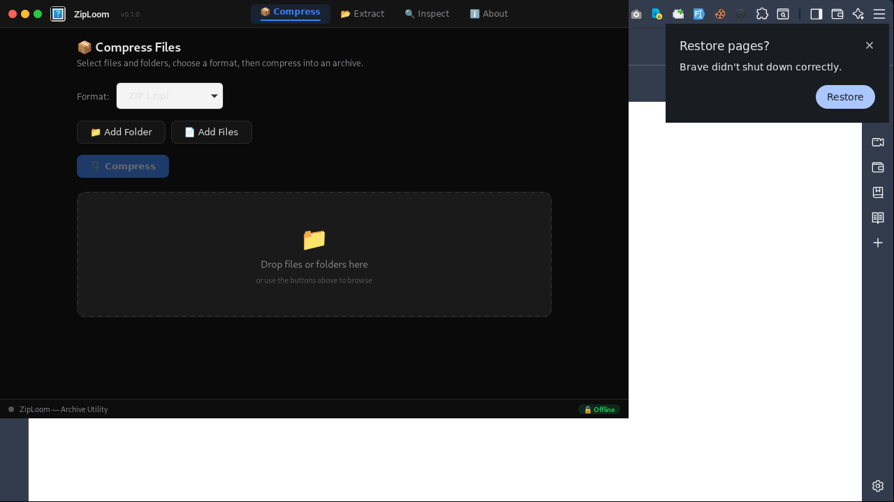
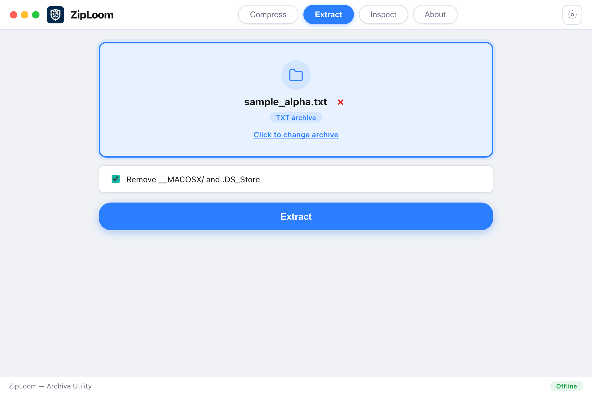
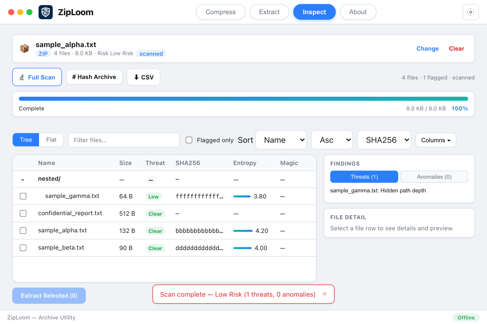
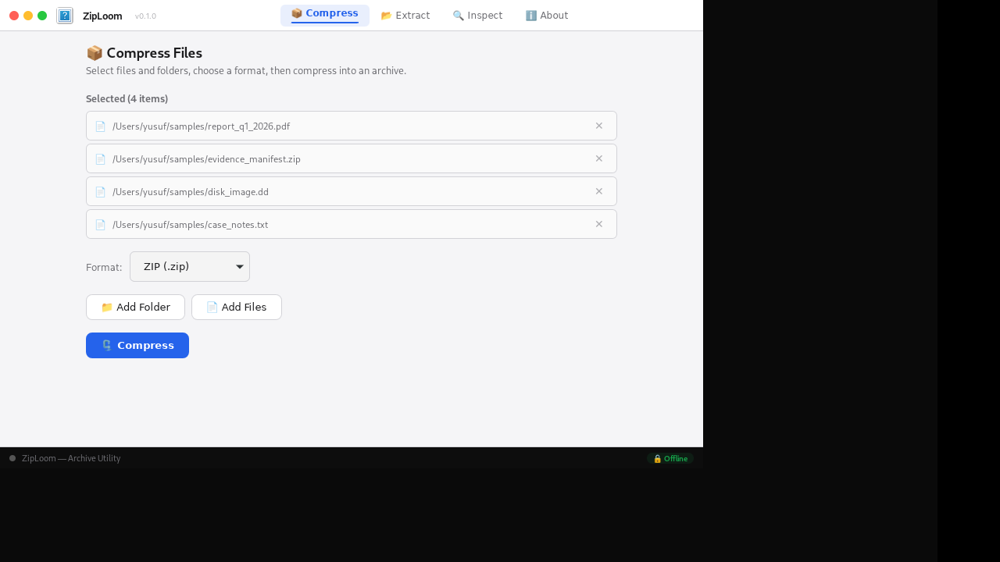
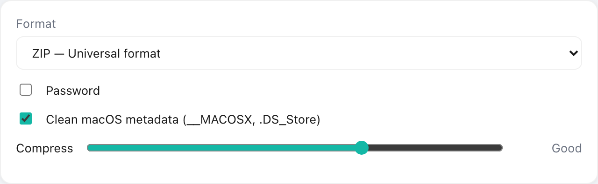

# ZipLoom 📦

[](https://github.com/YSF-Studio/ziploom/actions/workflows/ci.yml)
[](https://github.com/YSF-Studio/ziploom/actions/workflows/build.yml)
[](https://github.com/YSF-Studio/ziploom/actions/workflows/audit.yml)
[](LICENSE)


> **Archive compression, extraction & forensic inspection** — 100% offline. Built with **Tauri v2 + Rust + Svelte 5**.

| User guide | Developer docs |
|------------|----------------|
| [**docs/USER_GUIDE.md**](docs/USER_GUIDE.md) — install, every tab, password ZIP, troubleshooting | [**docs/DEVELOPER.md**](docs/DEVELOPER.md) — architecture, tests, CI, contributing |

---

## Screenshots

| Compress | Extract |
|:--------:|:-------:|
|  |  |

| Inspect | About | Password ZIP |
|:-------:|:-----:|:------------:|
|  |  |  |

---

## ✨ Features

| Tab | What you can do |
|-----|-----------------|
| **Compress** | ZIP, TAR, TAR.GZ, TAR.BZ2, TAR.XZ, TAR.ZST — drag & drop files/folders, compression level, optional **password-protected ZIP** (AES-256, 7-Zip / WinRAR compatible), clean macOS metadata |
| **Extract** | ZIP, TAR, GZ, BZ2, XZ, ZST, **7z**, **RAR** — pure Rust, no external CLI; password dialog for encrypted archives |
| **Inspect** | Load metadata → **Full Scan** (per-file MD5/SHA1/SHA256, entropy, magic bytes), tree/flat view, preview, threats/anomalies, CSV export, extract selected files |
| **About** | Version, feature list, legal disclaimer, offline privacy statement |

### UI & privacy

- **Theme toggle** in the titlebar — Light → Dark → System (one labeled button, no duplicate icon)
- **Drag & drop** on all workflow tabs
- **100% offline** — no telemetry, no network calls for core features
- Forensic results are **informational only** — verify independently before legal use

### Inspect highlights

- Split layout: virtualized file table + detail/findings panel
- Progress bar for long scans, hashing, and extraction
- Preview inside archives (text / hex / image, size-capped)
- Flagged-only filter, configurable columns, hash copy-on-click

---

## 📋 Quick usage

### Compress

1. Add files or folders (browse or drag & drop).
2. Choose format and options (password for ZIP only).
3. Click **Compress** → pick save location.

### Extract

1. Select an archive.
2. Click **Extract** → choose output folder.
3. Enter password if prompted.

### Inspect

1. Select an archive → **Load**.
2. Optional: **Full Scan** for hashes, entropy, magic-byte analysis.
3. Preview files, export CSV, or **Extract Selected**.

→ Full step-by-step guide: [**docs/USER_GUIDE.md**](docs/USER_GUIDE.md)

---

## 📦 Format support

| Format | Compress | Extract | Inspect | Notes |
|--------|:--------:|:-------:|:-------:|-------|
| ZIP | ✅ | ✅ | ✅ | Password AES-256 supported |
| TAR / .tar.gz / .tar.bz2 / .tar.xz / .tar.zst | ✅ | ✅ | ✅ | |
| 7z | — | ✅ | ✅ | |
| RAR | — | ✅ | ✅ | **Not on Windows** (build limitation) |

---

## 🚀 Quick start

### Run from source

```bash
git clone https://github.com/YSF-Studio/ziploom.git
cd ziploom
npm install
npm run tauri:dev
```

Dev server: `http://localhost:1422` — use **`tauri:dev`**, not `npm run dev`, for full archive features.

### Build installer

```bash
npm run tauri:build
```

### Linux dependencies (build)

```bash
sudo apt-get install -y libwebkit2gtk-4.1-dev libappindicator3-dev librsvg2-dev patchelf libssl-dev libpcap-dev
```

### Pre-built binaries

Download from [Releases](https://github.com/YSF-Studio/ziploom/releases).

---

## 🧪 Tests

```bash
npm run test:e2e      # Rust — 7 workflow tests (ZIP/TAR/password)
npm run test:gui      # Playwright — 15 UI smoke tests
npm run test:all      # Both

npm run screenshots   # Regenerate README screenshots
```

| Suite | Coverage |
|-------|----------|
| E2E (Rust) | 7/7 — compress → inspect → extract, password ZIP roundtrip |
| GUI smoke | 15/15 — tabs, theme toggle, compress, extract, inspect scan/hash/export |

CI runs on **ubuntu**, **macos**, and **windows** on every push to `main`.

---

## 🏗️ Tech stack

| Layer | Stack |
|-------|-------|
| Shell | Tauri v2 |
| Backend | Rust — `commands.rs` + `ysf-core` |
| Frontend | Svelte 5 + Vite 6 |
| Archives | zip, tar, sevenz-rust, unrar *(Unix)* |
| Forensic | Streaming hashes (256 KB buffer), entropy, magic-byte DB |

`ysf-core` lives in `src-tauri/crates/ysf-core/`. See [**docs/DEVELOPER.md**](docs/DEVELOPER.md) for architecture and contribution notes.

---

## 📁 Sample files

| Path | Purpose |
|------|---------|
| [`samples/`](samples/) | Demo documents for manual testing |
| [`tests/fixtures/e2e/`](tests/fixtures/e2e/) | Automated fixtures (`sample_alpha.txt`, `nested/…`) |

---

## 📄 License

MIT © [YSF Studio](https://ysfloom.com)

Made by **Yusuf Shalahuddin Al Ayyubi As Sobari**
