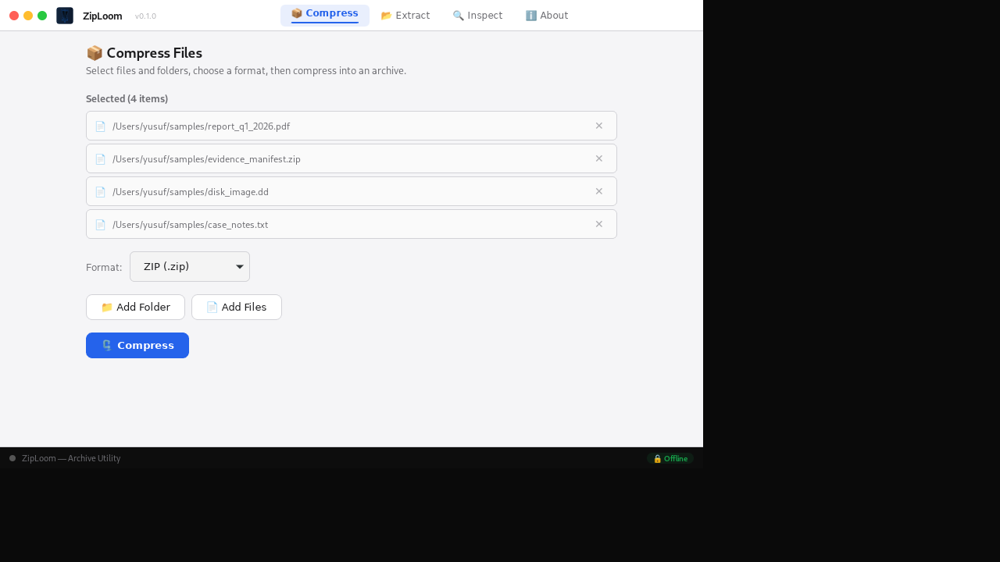
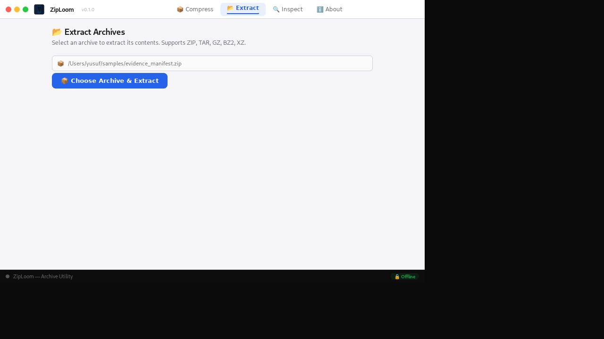
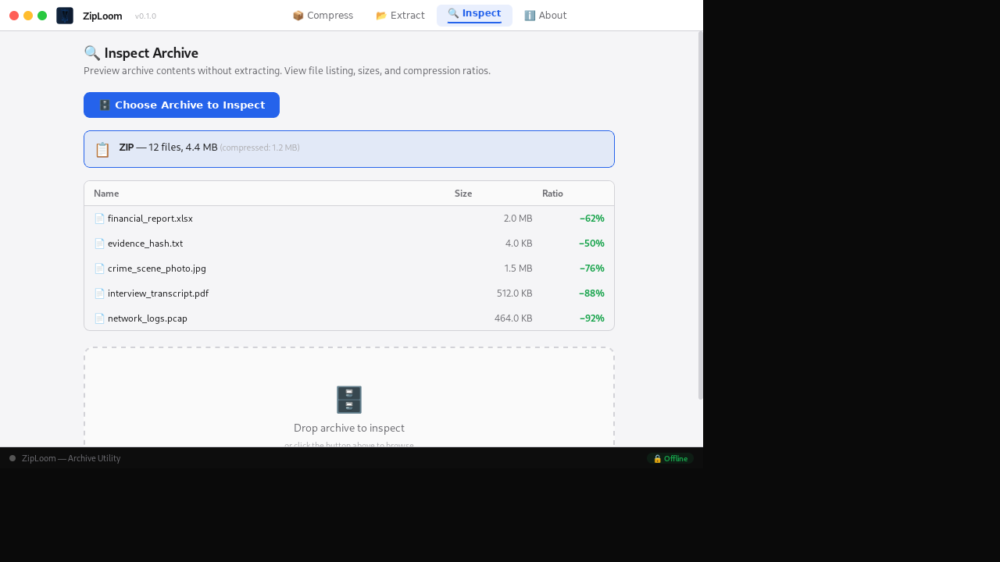
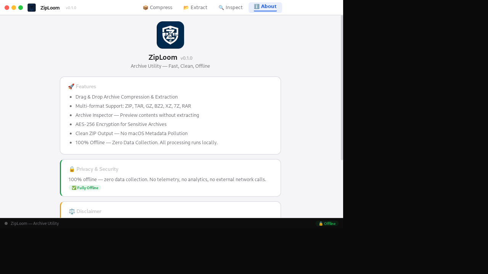

# 🗜️ ZipLoom — Archive Utility


**A professional archive compression & inspection tool** — built with Tauri v2 + Rust + SvelteKit.  
100% offline, zero data collection. Part of the [YSF Forensic Suite](https://github.com/YSF-Studio/ysf-forensic-suite).

---

## ✨ Features

- **📦 Compress** — ZIP, TAR, TAR.GZ with drag-and-drop
- **📂 Extract** — Multi-format extraction (ZIP, TAR, GZ, BZ2, XZ)
- **🔍 Inspect** — Preview archive contents without extracting, compression ratios, metadata
- **🔒 AES-256 Encryption** — PBKDF2 + AES-256-GCM for sensitive archives
- **🍎 Clean ZIP Output** — No macOS metadata pollution (`.DS_Store`, `__MACOSX`)
- **📁 Drag & Drop** — Drop files directly onto any tab
- **🌐 100% Offline** — All processing runs locally, zero telemetry

---

## 📸 Screenshots

### Compress
Select files and folders, choose a format, then compress into an archive.



### Extract
Select an archive to extract its contents. Supports ZIP, TAR, GZ, BZ2, XZ.



### Inspect
Preview archive contents without extracting. View file listing, sizes, and compression ratios.



### About
Version information, features, privacy & security, and disclaimer.



---

## 🚀 Quick Start

### Prerequisites
- [Rust](https://rustup.rs/) (latest stable)
- [Node.js](https://nodejs.org/) 18+
- System dependencies: `libwebkit2gtk-4.1-dev`, `build-essential`, `curl`

### Development
```bash
cd packages/ziploom
npm install
npm run tauri dev
```

### Build
```bash
npm run tauri build
```

---

## 🏗️ Architecture

```
ziploom/
├── src/                    # Svelte frontend
│   ├── App.svelte          # Main app component (4 tabs)
│   ├── main.js             # Entry point
│   └── lib/
│       └── Logo.svelte     # Inline SVG logo component
├── src-tauri/
│   ├── src/
│   │   ├── lib.rs          # Tauri app setup + commands
│   │   ├── main.rs         # Entry point
│   │   ├── commands.rs     # Tauri commands (compress/extract/inspect)
│   │   └── archive.rs      # Archive engine
│   └── Cargo.toml
└── package.json
```

---

## 🔒 Security

- **100% Offline** — No telemetry, no analytics, no external network calls
- **AES-256-GCM** — Password-based encryption with PBKDF2 key derivation
- **Input Validation** — Path traversal protection, format validation
- **Gitleaks** — Secret scanning on every push
- **Cargo Audit** — Weekly dependency vulnerability scan

---

## 📄 License

MIT © [YSF Studio](https://github.com/YSF-Studio) — Built with ❤️ by Yusuf Shalahuddin
